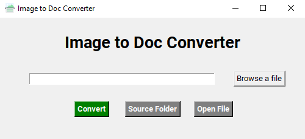
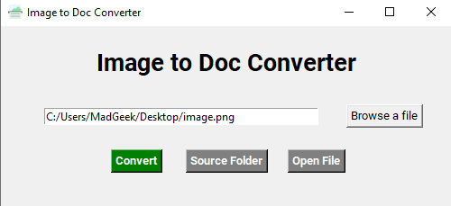

# Image-to-Doc-Converter

## Contents:
- [Description](#Description)
- [How to use](#How%20to%20use)
- [Screenshot](#Screenshot)
- [Download](#Download)

## Description:
Image to doc converter tool helps to translate JPG or PNG images to word with the assistance of text scanner.

## How to use:
1. Install Python 3.8.X from [here](https://www.python.org/downloads/).
2. Install tkinter `pip install tkinter`.
3. Install pillow from `pip install pillow`.
4. Install pytesseract from `pip install pytesseract`
5. Download `[tesseract 32-bit](https://rb.gy/gc55qc) or [tesseract 64-bit](https://rb.gy/yc6c2s)`
6. Clone this repository: `git clone https://github.com/iam-hasibul/Image-to-Doc-Converter` or click `Download ZIP` in the right panel and extract it.
7. Run `python img-to-doc.py` from the repository's directory.
8. Click on `Browse a file` button and choose an image file.
9. Click on `Convert` button to convert the image file to doc file.

## Screenshot:

## Download:
[Download Here](https://github.com/iam-hasibul/Image-to-Doc-Converter/blob/main/Image%20to%20Doc%20Converter-1.0-win32.msi)